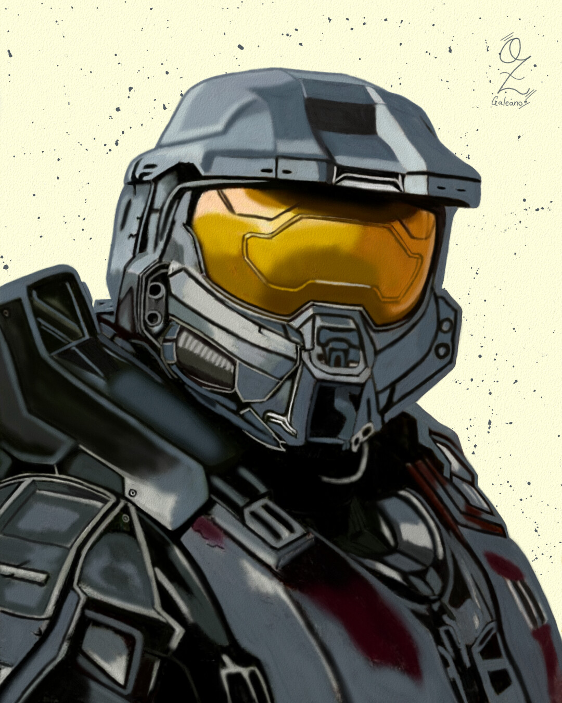

### **Nome:** Seraphin Duvall  
**Localização:** Vila de Krezk  
**Status:** Vivo  
**Descrição:**  
Ex-capitão da guarda, agora um andarilho. Usa um sobretudo surrado e um chapéu de abas largas. Sempre carrega um caderno velho onde anota tudo que vê. Fala pouco, mas observa tudo.

### **Afiliação:** [[Casa van der Voort]]  
Há rumores de que foi ele quem traiu a vila para Strahd. Ninguém sabe ao certo.  
### **Segredos ou Boatos:**  
Há rumores de que foi ele quem traiu a vila para Strahd. Ninguém sabe ao certo.  

### **Citação Marcante:**  
> "A justiça não é cega. Ela só finge não ver o que não quer lidar."

### **Primeira Aparição:** Sessão 04 – "As Chamas do Norte"
Há rumores de que foi ele quem traiu a vila para Strahd. Ninguém sabe ao certo.  

---

### 🖼️ **Galeria de Imagens Alternativas**

  
  
  

